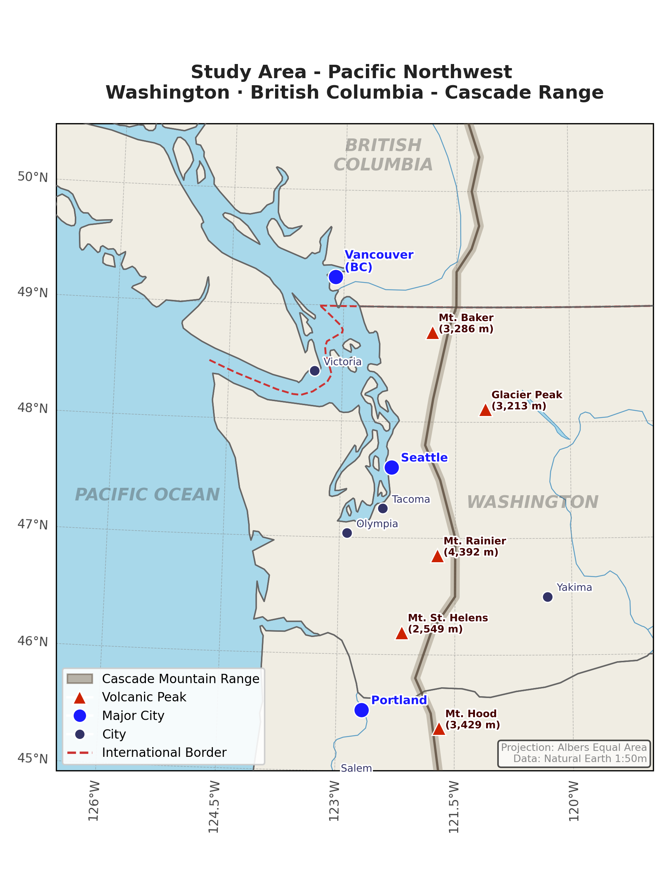
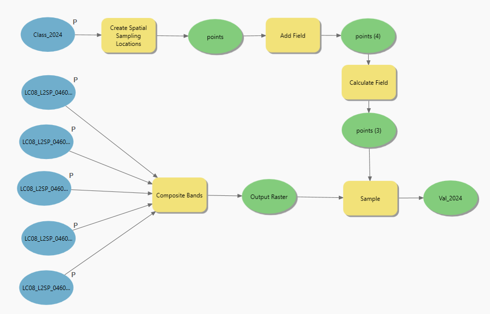
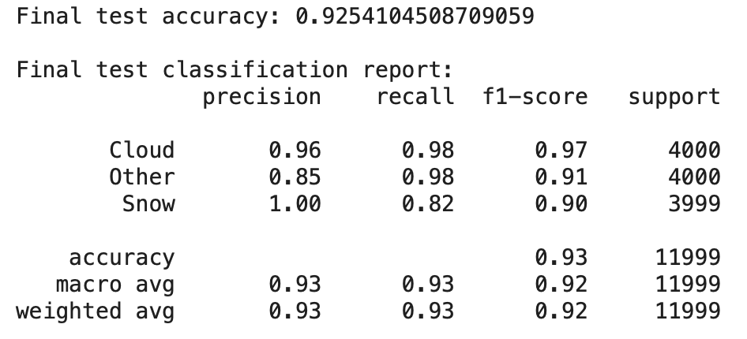
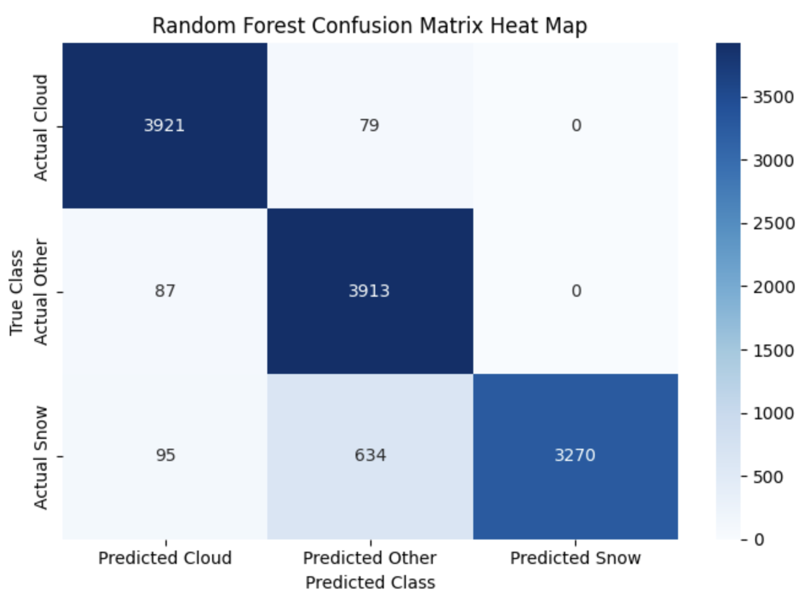
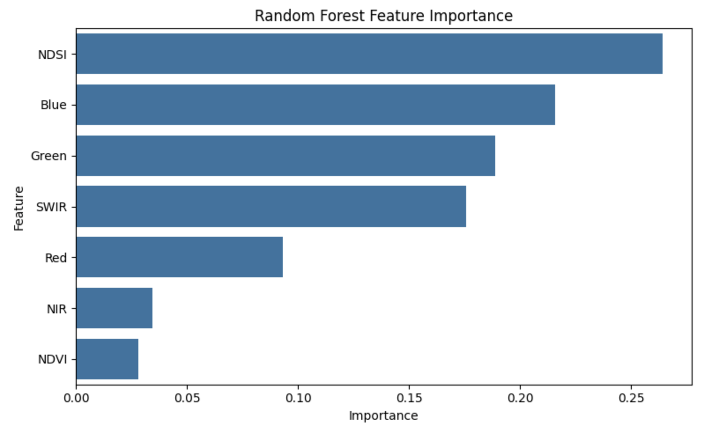

# Improving Snow Cover Classification in Cloudy Mountain Regions Using Machine Learning

Authors: Dishant Sharma, Brock Medernach

## I. Introduction and Background

The Pacific Northwest (PNW) of North America is characterized by a maritime climate strongly influenced by the Pacific Ocean, resulting in high annual precipitation, persistent cloud cover, and significant seasonal snowfall (Figure 1). The Cascade Range, extending from northern California to British Columbia, plays a critical role in shaping this climate through orographic lifting, where moist air masses are forced upward over mountainous terrain, cooling and condensing to produce clouds and precipitation (Cascade Backcountry Alliance, 2023). This process leads to extensive snow accumulation at higher elevations, making the region a key contributor to downstream water resources.

Snowpack in the Cascade Range serves as a natural reservoir, storing water during the winter and releasing it gradually through spring and summer melt. This process is especially important for urban areas such as Seattle, which rely heavily on snowmelt-driven runoff for municipal water supply (City of Seattle, 2024). Accurate snow cover mapping is therefore essential for hydrologic modeling, water resource management, flood forecasting, and understanding broader climate variability. Errors in snow cover estimation can propagate into significant uncertainties in water availability predictions, particularly in regions where snow dominates seasonal hydrology.

Despite its importance, accurately distinguishing snow from cloud cover using traditional remote sensing techniques remains a persistent challenge. Both snow and clouds exhibit high reflectance in visible wavelengths, particularly in the red, green, and blue (RGB) bands, making them spectrally similar in standard satellite imagery. Although indices such as the Normalized Difference Snow Index (NDSI) are commonly used to differentiate snow from other surfaces, their performance is often limited under conditions of thin cloud cover, mixed pixels, or complex terrain (Hall et al., 2002; Dozier et al., 2009). These limitations are especially pronounced in mountainous regions like the Cascades, where topographic shading, vegetation cover, and frequent cloud presence further complicate classification.
To address these challenges, machine learning (ML) approaches have increasingly been applied to snow cover mapping. Unlike traditional threshold-based methods, ML models can learn complex, nonlinear relationships between spectral features and land cover classes, enabling improved discrimination between snow, clouds, and background surfaces. Algorithms such as Random Forest and gradient boosting methods (e.g., XGBoost) have demonstrated strong performance in remote sensing classification tasks due to their robustness to noise and ability to handle high-dimensional datasets (Belgiu and Drăguț, 2016; Maxwell et al., 2018). These models are particularly effective when trained on well-labeled datasets that incorporate both spectral bands and derived indices.

> Figure 1. Pacific Northwest 

More recently, deep learning (DL) approaches, particularly convolutional neural networks (CNNs) such as U-Net architectures, have shown promise in further improving classification accuracy by incorporating spatial context in addition to spectral information. These models are capable of capturing spatial patterns and textures within imagery, which can be critical for distinguishing between clouds and snow in complex environments (Zhu et al., 2017; Ma et al., 2019). While DL methods require larger datasets and greater computational resources, they represent a powerful extension of traditional ML approaches for remote sensing applications.

This study focuses on the Seattle watershed in Washington State, where reliable snow cover estimation is essential for understanding regional water availability. Using Landsat satellite imagery from 2020 to 2025, along with derived spectral indices such as NDVI and NDSI, we develop and evaluate a supervised machine learning framework to classify surface conditions into three categories: snow, cloud, and background land cover. By explicitly treating clouds as a separate class rather than masking them, this approach aims to produce a more realistic and operationally useful classification product. The primary objective of this study is to assess the effectiveness of machine learning methods in accurately distinguishing snow from cloud cover under the challenging environmental conditions of the Cascade Range.

## II. Data and Methods

This project focuses on the Cascade Mountain Range in the Pacific Northwest (Washington State and part of British Columbia), a region known for persistent winter cloud cover and complex terrain that makes snow mapping particularly challenging. The study area is limited to a manageable number of sub-regions in order to keep computation realistic while still capturing a range of elevation zones, vegetation conditions, and snow climates. The primary remote sensing dataset Landsat surface reflectance imagery, because it provides high spatial resolution (30 m) and includes spectral bands that are highly sensitive to snow and cloud reflectance. This dataset is available for past few decades, but we have mainly focused on years following 2020 (Table 1).

Table 1: Satellite imagery used in this project

| Image ID 	| Acquisition Date |	Centered on |	Season|	Cloud Cover	| Spatial Resolution|	ML Purpose
|---------|---------|---------|---------|---------|---------|---------|
|LE07_L2SP_045027_20201128_02_T1 |	28 Nov 2020	| Yakima	| Winter 2020 |	20%	| 30m	| Train|
|LC09_L2SP_046026_20220109_02_T1 |	09 Jan 2022	| Vancouver	| Winter 2021	| 20.46%	| 30m	| Train|
|LC08_L2SP_046026_20221203_02_T1 |03 Dec 2022	| Vancouver	| Winter 2022	| 21.53%	| 30m	| Train|
|LC08_L2SP_046026_20240107_02_T1 |	07 Jan 2024	| Vancouver	| Winter 2023	| 37.44%	| 30m	| Train|
|LC08_L2SP_046026_20250314_02_T1 |	14 Mar 2025	| Vancouver	| Winter 2024	| 25.86%	| 30m	| Validate|
|LC09_L2SP_047027_20260212_02_T1 |12 Feb 2026	| Seattle	| Winter 2025	| 28.91%	| 30m |	Test|
 

Five spectral bands are used in this project- Blue, Green, Red, Near InfraRed (NIR), and Short-Wave Infrared (SWIR). Spectral indices such as the Normalized Difference Snow Index (NDSI) and Normalized Difference Vegetation Index (NDVI) are calculated from Landsat bands and used both as predictive features and as a baseline snow-mapping method for comparison. 

The project frames snow mapping as a three-class classification problem consisting of snow, cloud and other. The “other” class consists of land cover such as trees, water, bareground, agricultural land, and built-up areas. Rather than attempting to infer snow under clouds using purely optical data, cloud cover is treated explicitly as its own class to create a more honest and operationally realistic product. 

To create training, validation, and testing labels, all five spectral bands were first loaded into ArcGIS Pro and projected to WGS 1984 UTM Zone 10N. Using the Composite Bands tool in the geoprocessing toolbox, the bands were stacked into a single multiband raster for each year, creating a permanent dataset suitable for modeling (while temporary composites for digitization can alternatively be generated through Imagery → Raster Functions → Data Management → Composite Bands). For each year, a polygon feature class was created with a class label field, and training polygons were digitized for each land cover class. Stratified random sampling was then performed using the “Create Spatial Sampling Locations” tool, ensuring equal representation across classes with 4,000 samples per class and a minimum spacing of 30 meters between points. A class label field was populated using conditional logic (“Cloud” if CID = 1, “Other” if CID = 2, and “Snow” if CID = 3). Finally, the Sample tool from Image Analyst was used to extract spectral values at the sampled locations, producing a table for subsequent analysis and modeling. Model Builder in ArcGIS Pro is used to develop a model to automate sampling process (fig.1). More than 70,000 pixel data points are extracted into csv files where each row represents a single pixel value and columns represent latitude, longitude, band values and indices.

> Figure 2. Model created in ArcGIS Pro which takes 5 raster images and a polygon file for three classes, and outputs a labelled class table.

The csv files thus generated are further processed using Pandas Python library in Google Colab environment, which involved data cleaning where null values are removed. To avoid overly optimistic results caused by spatial autocorrelation, the dataset is split using a spatial holdout approach, where training and testing are conducted on separate geographic regions rather than randomly mixing pixels from the same scene. To further avoid data leakage, scenes from different years will be used for training and testing. This ensures that the models are evaluated on their ability to generalize to new areas of the Cascades, which is critical for real-world applicability. To achieve this purpose, four images from 2020 to 2023 are used to create the training set, while the 2024 image is used for validation and 2025 image is used for testing the machine learning model. It is done to ensure there is no temporal data leakage into the model. In addition, model is trained, validated and tested on different Landsat scenes centered on Vancouver, Yakima, and Seattle to minimize data leakage through spatial autocorrelation and improving model’s generalizability to different spatial regions. 

Using Scikit-Learn library, data is standardized and made suitable for ML modelling, A Random Forest classifier is trained using pixel-based feature vectors that include spectral reflectance bands, snow and vegetation indices, and coordinates. Random Forest serves as a strong baseline because it performs well on structured tabular data and is relatively robust to noise. Second, an XGBoost model will be trained using the same feature set. XGBoost is expected to improve performance through gradient boosting and is commonly used in industry due to its high accuracy and efficient handling of nonlinear relationships. Model performance is evaluated using metrics appropriate for segmentation and multi-class classification, including overall accuracy, precision, recall, and F1-score. 
All preprocessing, modeling, and evaluation steps will be implemented in Python using standard geospatial and machine learning libraries. The final output will be designed as a reproducible workflow that produces snow/no-snow/cloud classification maps in georeferenced raster format, along with summary statistics such as snow-covered area by elevation band which could be exported as a csv file. 

Table 2: Python packages used in this project

| Package 	| Purpose |	Experience level 
|---------|---------|---------|
|GeoAI Py |	Download satellite imagery	| Good	(3/4)| 
|Rasterio |	Handle and manipulate raster images	| Good	(3/4)| 
|NumPy |Mathematical operation	| Good	(3/4)| 
|Pandas |	Handle and maipulate tables	| Good	(3/4)	| 
|Scikit-Learn |	Data preprocessing and ML	| Good	(3/4)	| 
|Cartopy |Create Maps	| Good	(3/4)| 
|Matplotlib |Create Plots	| Good	(3/4)| 
|Seaborn |Create Plots| Good	(3/4)| 

## III. Feasibility and Ambition
Prior work on snow/cloud classification using satellite imagery does exist, with studies applying methods like NDSI, Random Forest, XGBoost, and U-Net to Landsat data with DEM-derived variables. What distinguishes this project is its reframing of cloud cover from a nuisance to be masked out into an explicit classification target that an ML model can learn to distinguish alongside snow. Both team members bring prior experience with satellite imagery, GIS tools, and weather data, and while Python skills are still developing, the team has a solid conceptual grasp of the full workflow from data acquisition through model training. The computational plan is realistic, with CPU reserved for RF and XGBoost and GPU reserved for U-Net if needed, and the team expects that gaps in ML training experience will close as the course progresses.

## IV. Potential Issues
The most significant technical risk is data volume: because the study area is limited to the Cascade mountain range rather than a broader continental domain, there may not be enough analogous Landsat imagery to effectively train a three-class classifier at the required spatial detail. Integrating SRTM/DEM-derived variables adds another layer of complexity, particularly in ensuring that slope, elevation, and aspect indices are correctly calibrated and aligned to the satellite grid. Beyond those data challenges, limited prior experience with training machine learning models is the team's most honest self-identified barrier, though the structured course environment should help close that gap over time.

## V. Timeline

Table 3: Major Milestones and Timeline 

| Task 	| Time Estimate |	Confidence | Notes 
|---------|---------|---------|---------|
|Gather Landsat satellite data |	1 week	| Great	(4/4)| Our group has worked with Landsat data and know where to get it and how to use it|
|Preprocess data (Stack satellite images, align the coordinate system and spatial resolution) |	2 weeks | Good	(3/4)| Our group has preprocessed satellite data before in ArcGIS Pro, but not in Python |
|Create class labels for snow/no snow/cloud | 2 weeks	| Good	(3/4)| Our group has experience creating labels using GIS software |
|Train and test the machine learning models|	3 weeks	| Fair	(2/4)	| Our group has trained a machine learning model before on tabular dataset. We need to figure out how to do it using image datasets |
|Write up the report |	2 weeks	| Good	(3/4)	| Both group members have written up scientific results before and discussed them in a course paper or research article|

## VI. Results

After preprocessing and removal of null values, the dataset consisted of 47,783 training samples, 12,000 validation samples, and 11,999 test samples. Predictor variables included Landsat spectral bands (Blue, Green, Red, NIR, and SWIR), derived indices (NDVI and NDSI), and optional spatial coordinates (X, Y). These types of predictors were chosen because Liu et al. (2020) identified that spectral indices such as NDSI, combined with SWIR information, significantly improve snow classification performance in mountainous environments. 
 
First, data from 2020-2023 was used to train the model and test it against the 2024 validation data. The baseline Random Forest classifier achieved a validation accuracy of 0.8307, with precision, recall, and F1-scores ranging from 0.66 to 1.00 across all classes. This level of performance is consistent with previous studies demonstrating that Random Forest performs strongly in remote sensing classification due to its ability to capture nonlinear relationships and handle complex, high-dimensional data (Belgiu and Drăguţ 2016). Similar findings are reported by Maxwell et al. (2018), who show that Random Forest consistently performs well in land-cover classification tasks across diverse environments.

Second, data from 2020-2023 was split into smaller internal training sets or “folds” and tested against itself to determine the best hyperparameters using GridSearchCV. During GridSearchCV hyperparameter tuning, the cross-validation score jumped up to 0.9779. A higher cross-validation accuracy is expected when compared to baseline validation accuracy because the model is not being tested against the validation data. This means that there is less “untested” data for the model to potentially have trouble with. After hyperparameter tuning, the model achieved a validation accuracy of 0.8307. This accuracy is identical to the baseline accuracy. This behavior has also been observed by Millard and Richardson (2015), who emphasize the importance of training data quality in Random Forest classification performance.  

Third, a feature importance ranking was created in order to determine which predictors were the most influential in classifying a scene as snow, cloud, or other. Stillinger et al. (2019) observed that in alpine regions, cloud cover becomes a significant issue in satellite-imagery based classification. This explains why NDSI was the most influential at 0.2641 importance in helping classify a scene. Normalized Difference Snow Index (NDSI) was specifically designed to help distinguish snow in satellite imagery, which otherwise, could be easily confused for a cloud (Hall et al. 2002). It relies on the ratio of green reflectance to shortwave infrared reflectance; a higher NDSI value signifies the scene is more likely to be snow (Dietz et al. 2012). NDVI was the least influential with an importance ranking of 0.0282. This is the case because snowpack and cloud cover are optically similar in satellite imagery while vegetation would appear very different. Consequently, Normalized Difference Vegetation Index (NDVI) will have little importance in helping distinguish between snowpack, cloud cover, and other. 

Lastly, a final model was produced. At this point, training predictors ae scaled and those scaling parameters are applied to the testing dataset. Optimal parameters from GridSearchCV are applied to the model as it trains to predict 2025 class labels. The final test accuracy is determined based on how many pixels were correctly identified. The final test accuracy came out to be 0.9254. This result indicates that the 2025 testing data was easier to classify against as opposed to the 2024 validation data.  

The validation confusion matrix indicates that 3995/4000 cloud cases were successfuly identified, with only 5 being predicted as “other”. Out of the true “other” cases, 3984/4000 were successfully predicted with only 16 being misidentified as cloud cover. Conversely, snow classification was difficult for the tuned / validation model. Out of the 4000 “actual” snow cases, only 1989 were successfully identified. The rest of the cases were mainly misidentified as clouds (2009).

The final confusion matrix (Figure 4) illustrates a notable improvement from the validation confusion matrix. For snow classification in particular, precision jumped from 1989 actual cases successfully identified to 3270 cases accurately identified. On the contrary, accurate “cloud” and “other” classification fell slightly. Correct “other” identification went down from 3984 to 3913. Similarily, correct “cloud” classification fell from 3995 to 3921. Initially, the validation model was extremely precise in classifying snow (1.00), yet; would miss around 50% of actual snow cases (poor recall). Correct identification of “other” and “cloud” fell slightly, indicating the model was less conservative / had an easier time labeling 2025 snow data. These results are in line with studies from researchers like Luo et al. (2022), Jin et al. (2022), and Zhu et al. (2017) who have proven that machine learning patter recognition is effective in snow/cloud differentiation compared to traditional threshold-based approaches; especially in adverse field areas.

Previous studies have shown that spatial autocorrelation and similarities between training and validation datasets can lead to inflated performance estimates. Karasiak et al. (2022) demonstrate that improper spatial separation can artificially increase classification accuracy in remote sensing applications, while Ploton et al. (2020) show that models evaluated without strict spatial independence often perform poorly when applied to new regions. Overall, the results indicate that the Random Forest model is highly effective for distinguishing snow, cloud, and background land cover in the Cascade Range. The combination of spectral bands and derived indices provides strong predictive capability, and model performance is consistent with findings from previous machine learning-based snow mapping studies. However, final conclusions regarding model robustness will depend on evaluation using a fully independent test dataset.
 

> Figure 3. Classification Report

> Figure 4. Classification Matrix

> Figure 5. Feature Importance

## VII. Summary

This project explores the utility of supervised Machine Learning techniques to improve snow cover classification in the mountain regions which receive high winter precipitation and cloud cover remains high. Traditional remote sensing supervised classification algorithms such maximum likelihood often confuses cloud cover with snow cover leading to overestimation of the latter. We have chosen Pacific-Northwest as the study area based on its climatic regime. We have created an API from automatic satellite data acquisition from Microsoft Planetary Computers, which only requires location coordinates, time period, and cloud cover percentage from user’s end. Six satellite images from Landsat-7, 9 and 9 sensors acquired between 2020 and 2025 are used in this project to create training, validation, and testing datasets for this project. Geoprocessing tools in ArcGIS Pro are used for creating the labelled dataset. Further processing and modelling are done using Python libraries in Google Colab environment. Pandas is used read csv files and to remove null values. Additional features (NDSI and NDVI) are also created from existing features using Pandas. Scikit-Learn is used to standardize the datasets. Random Forest model is trained on 2020-2023 data, validated on 2024 data, and tested on 2025 data using the best performing hyperparameters. Overall, the Random Forest model achieved more than 90% classification accuracy, demonstrating that combining spectral bands with derived indices such as NDSI is highly effective for distinguishing snow, cloud, and background land cover in the Cascade Range. The strong performance across all metrics indicates that the model is robust and capable of generalizing unseen validation data well. 

In future, other Machine Learning Models such as XGBoost and CatBoost, and deep learning models, specifically Convolutions Neural Networks (U-Nets) could be trained to improve the classification. Including additional features such as, elevation, slope, aspect, thermal bands can possibly improve the model performance. Training the model on similar mountain regions from Southern Hemisphere, such as, Patagonian Andes, can possibly introduce more variation that ML and DL models can learn from. 

## VIII. References

Belgiu, M., and L. Drăguţ, 2016: Random forest in remote sensing: A review of applications and future directions. ISPRS J. Photogramm. Remote Sens., 114, 24–31.

Cascade Backcountry Alliance, 2023: Washington weather: Introduction and resources. [Available online at https://www.cascadebackcountryalliance.com/post/washington-weather-introduction-and-resources.]

City of Seattle, 2024: Seattle Public Utilities. [Available online at https://www.seattle.gov/utilities.]

Dietz, A. J., and Coauthors, 2012: Remote sensing of snow—A review of available methods. Int. J. Remote Sens., 33, 4094–4134.

Dong, C., and Coauthors, 2022: Mapping snow cover in forests using optical remote sensing, machine learning, and time-lapse photography. Remote Sens. Environ.

Hall, D. K., and Coauthors, 2002: MODIS snow-cover products. Remote Sens. Environ., 83, 181–194.

Jin, D., and Coauthors, 2022: An improvement of snow/cloud discrimination from machine learning using geostationary satellite data. Big Earth Data, 6, 739–755.

Karasiak, N., and Coauthors, 2022: Spatial dependence between training and test sets: Another pitfall of classification accuracy assessment in remote sensing. Mach. Learn., 111, 2715–2740.

Liu, C., and Coauthors, 2020: MODIS fractional snow cover mapping using machine learning technology in a mountainous area. Remote Sens., 12, 962.

Luo, J., and Coauthors, 2022: Mapping snow cover in forests using optical remote sensing, machine learning, and time-lapse photography. Remote Sens. Environ., 276.

Ma, L., and Coauthors, 2019: Deep learning in remote sensing applications: A meta-analysis and review. ISPRS J. Photogramm. Remote Sens., 152, 166–177.
Maxwell, A. E., and Coauthors, 2018: Random forest classification in remote sensing: A review of applications and future directions. Remote Sens., 10, 463.

Millard, K., and M. Richardson, 2015: On the importance of training data sample selection in random forest image classification. Remote Sens., 7, 8489–8515.

Ploton, P., and Coauthors, 2020: Spatial validation reveals poor predictive performance of large-scale ecological mapping models. Nat. Commun., 11, 4546.

Richiardi, C., and Coauthors, 2023: Snow cover mapping using random forest classification in alpine regions. Remote Sens., 15, 343.

Stillinger, T., and Coauthors, 2019: Cloud masking for Landsat 8 and MODIS Terra over snow-covered terrain: Error analysis and implications for snow mapping. Water Resour. Res., 55, 10607–10623.

Zhu, X. X., and Coauthors, 2017: Deep learning in remote sensing: A comprehensive review and list of resources. IEEE Geosci. Remote Sens. Mag., 5, 8–36.

## IX. Requirements 

Table 4: Project Requirements identified in the beginning

| Requirement 	| Priority |	Sprint | Assigned to | Description | Acceptance Criteria | Automatic Test 
|---------|---------|---------|---------|---------|---------|---------|
|Create API for automatic Satellite data ingestion |	High	| 1 | Dishant | As a developer of a machine learning model, I need to create an API for automatic satellite image download from the cloud so that there is no need to manually download data from a portal like USGS Earth Explorer and then upload it to Google Colab | API works for user provided study area coordinates and time range.	Dataset must be in a format (.TIF) that can be easily read and modified either via Python or through desktop GIS software such as QGIS or ArcGIS Pro | Create a script that tests if satellite image has all the required spectral bands, is from the correct year and is in the correct format. If these conditions are not met, return an error |
|Stack satellite images from multiple years (2020-2025)|	High	| 1 | Brock | As a developer of a machine learning model, I need to stack Landsat 8-9 satellite images from 2020-2025 into a composite multiband dataset. The variety in spatial and spectral data over a 5-year time span will be sufficient for training snow/cloud classification models | Multiband Landsat imagery from 2020-2025 successfully loads and stacks into a workable multi-band structure using xarray. All images are aligned using the same coordinate system, spatial resolution, and extent. Stacked datasets include required spectral bands for snow detection | Create a script that tests whether the required years (2020 – 2025), necessary bands and calculated layers, projection, resolution, and extent are correctly projected |
|Create Class Labels |High|1| Dishant | As a developer of machine learning model, I need to classify pixels in satellite images into three land cover classes: Snow, Cloud, and Background so we have data that we can train and test the models on | Rows must represent pixels and columns must represent bands (Red, Green, Blue, and SWIR), derived layers, image metadata (like year) and class labels (0=background, 1=snow, 2=clouds) | Create a script to test if the table has a column for label class with no null values. If not, send an error |
|Data preprocessing for ML |	High	| 2	| Brock | As a developer of a machine learning model, I need to clean and standardize structured data (tabular) sets for the models to efficiently learn the relationship between spectral features and land-cover classes | Dataset is in tabular format; rows are pixels, columns are spectral bands and derived indices. Dataset split into: training (2020-2023), validation (2024), and testing (2025). All variables normalized and scaled correctly after the split | Create a script to test if the preprocessed dataset contains all the required variables, no missing values, is corrrectly split into training, validation, and test stages set by year, and is exportable as a CSV. If not, send an error |
|Train, validate and test ML models  |	High	| 2	| Both members | As developers of machine learning model, we need to format the data and variables that we have gathered so we can develop, train and test the Random Forest ML model | Data fields must be reduced to just the necessary data required for the model. Data should be formatted into a csv file that can be inputted into the scikit-learn Random Forest framework. Evaluate model performance based on Confusion Matrices, Precision, Recall, and F1 scores | Create a script that reads the csv file and checks if all fields/data are present. If not, generate an error showing what is missing |
|Run and test U-net Deep Learning model (dropped due to computational and time constraints)|Low	| 2| Both members | As developers of Deep Learning model, we need to train and evaluate a U-Net model on its ability to process satellite imagery and pull spatial patterns from the images to improve snow / background / cloud classification | U-Net model accepts multi-band satellite imagery as an input and addition of layers like a Digital Elevation Model (DEM) as additional channels.	Segment and classifies the image into snow / background / cloud. Both training and validation / testing data sets are used during training vs evaluation stages concerning the model. Model output stays georeferenced |Create a script that verifies the U-Net model successfully produced a 3-class, georeferenced raster using the required evaluation metrics|

